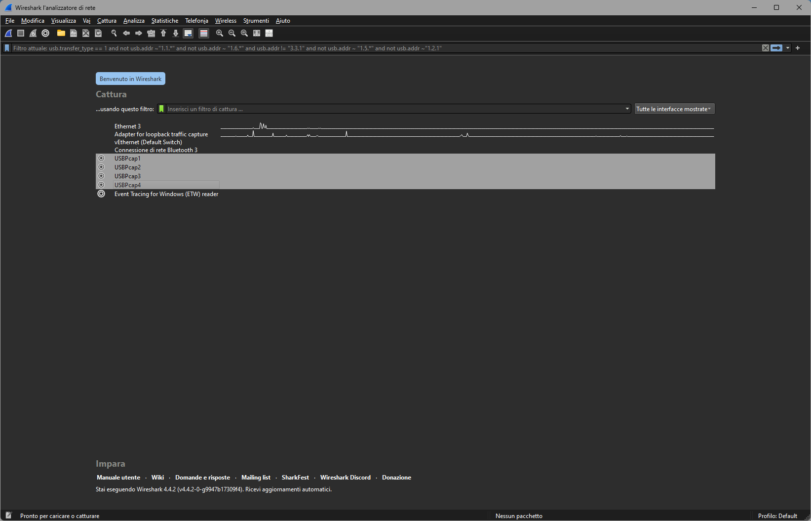
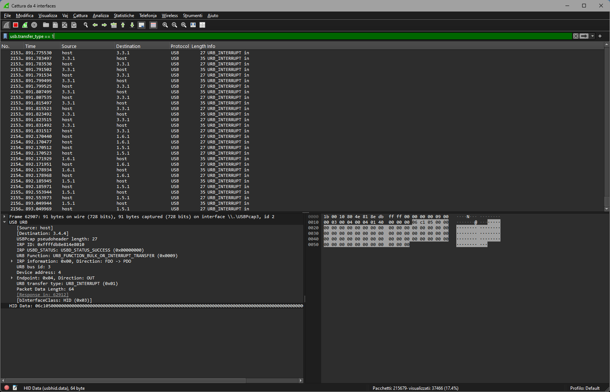
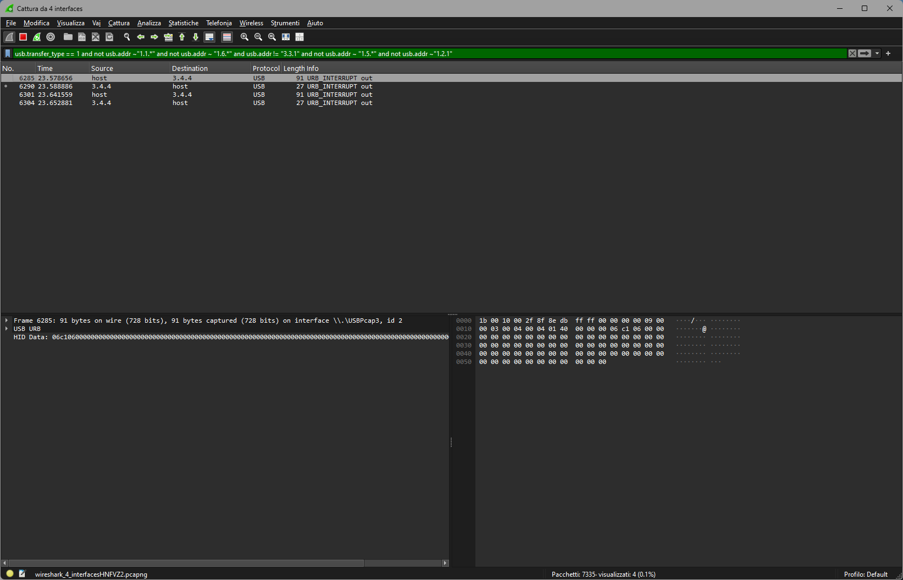
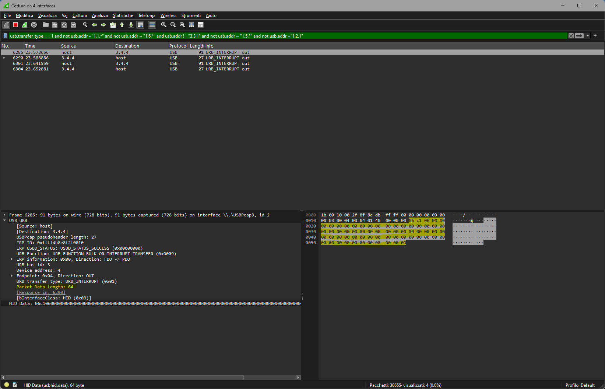
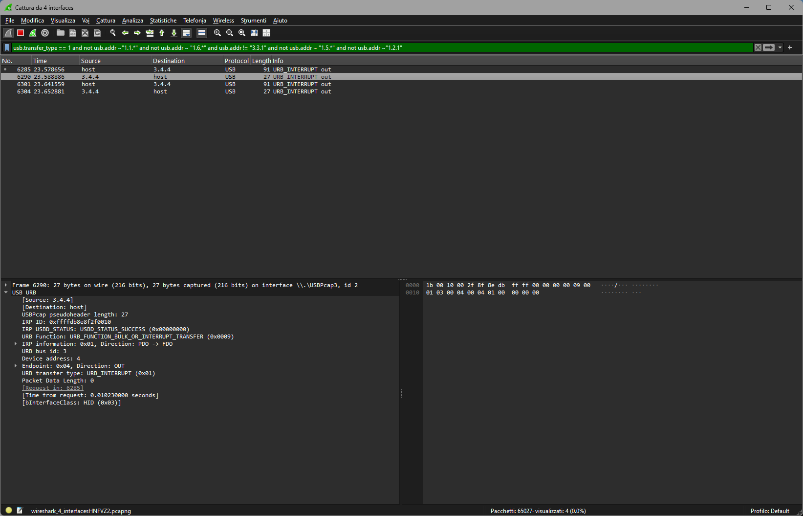

# Quick Wireshark guide on how to analyze USB traffic

## Introduction

In order to create a proper `DeviceManager`, it is required to understand the USB traffic. To do so, a tool like Wireshark comes handy to analyze what the host (the computer) and the device (the dongle / DAC / whatever) are talking to each other.

## Requisites

1. The SteelSeries GG software installed (on a Windows host, or a Windows VM with attached SteelSeries USB device)
2. Wireshark installed on Windows, with usbpcap drivers. Don't forget to reboot after install, as suggested by the software installer!

## Step 1: recognize the device

This is quite a try and error approach, but usually it works.

### Step 1.1: start the listening

First things first: listen on USB hubs. In my particular case, I have 4 different hubs, so I have 4 different USBpcap interfaces in wireshark. If you know on which hub the device is on, choose that one directly, otherwise select them all, like in this screenshot, then click on the blue fin icon on the top left of the application.

### Step 1.2: filter the output

The USB traffic is like the one you can get on the highway early in the morning. There will be tons of messages, and none of them are the ones we need. Based on my experience with Arctis devices (see: Nova Pro Wireless), settings are sent via USB interrupt messages, so the first filter we want to set is just that one: `usb.transfer_type == 1`

This won't be probably enough though, as the traffic spam won't just stop yet. As we're not saving any device settings, we're pretty sure all the addresses showing in the log are just *other devices* we don't care about. So we can start filtering them away, with the following filters:

- `usb.addr != "1.2.3"` to block a particular hub.address.port
- `not usb.addr ~= "1.2.*"` to block an entire hub.address (if we understand that's not our device)

Once the log is clean, or pretty stable (no new messages), we can open the SteelSeries GG software, enter the relative Engine device (the Arctis device), make a single change (for example: device shutdown after inactivity) and hit save. A new interrupt message should appear on Wireshark. If not, we have probably slashed the device in the filters.

At this point we can either change the filter to address the single device (in this case it'd be `usb.addr == "3.4.4"`), or keep the filter like it is.

## Step 2: watch the packets

In this example, I edited the setting "Shutdown the device after..." and set it to 60 minutes.

The USB packets always have a header and might or might not have a response. In this case, the request (from host to device) is composed by a content of 64 bytes, with the following message (hexadecimal): **06 c1 06**, followed by 61 zeros. The response from the device is just an acknowledge with no payload.

The host, after sending the first request, also sent a second packet (which for your interest is **06 09** followed by 62 zeros). This request receives again an acknowledge response with no payload.

Now you can repeat the process to map all the setting of the device, with all the possible values. In the given example **06 c1** is the packet to set the shutdown period, while **06** is the value set, which ranges from **00** (off) to **06** (60 minutes).

## Extra: device initialization

It is useful to understand that the Arctis devices might be initialized upon connection. It is thus useful to unplug the device, start the wireshark listening again (with the filters applied), insert the device **in the same USB port** and watch what happens. Once you've mapped the settings, you'll probably find known and unknown packets passing through, some of which might enable some functionalities like the knob for the mixer (which on the Nova Pro Wireless is disabled by default).

Another note: some requests are being replied with data, which usually contain the device status. Not all the settings are returned though, in my experience. Take a look on [ArctisNovaProWirelessDeviceManager](../arctis_manager/devices/device_arctis_nova_pro_wireless.py) to get an idea on how to manage the device status.

## Final words

Good luck! Don't hesitate to contact me opening an issue!
